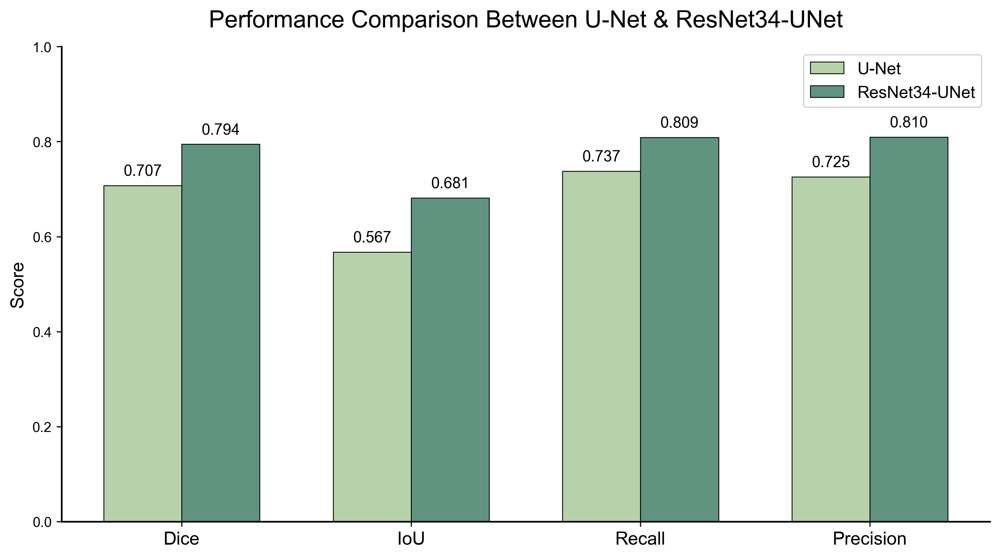
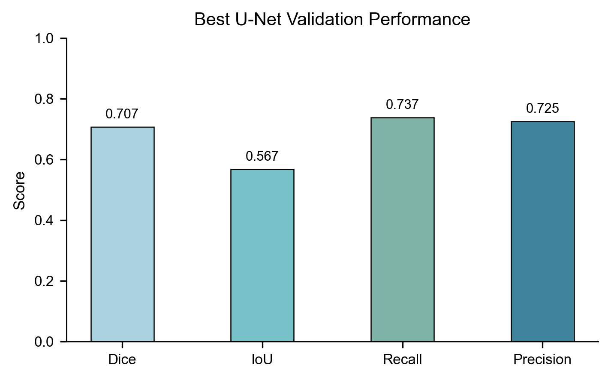
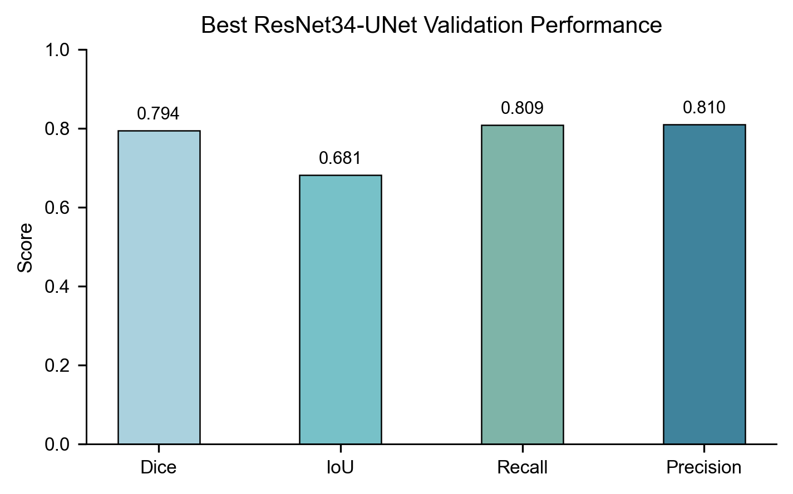
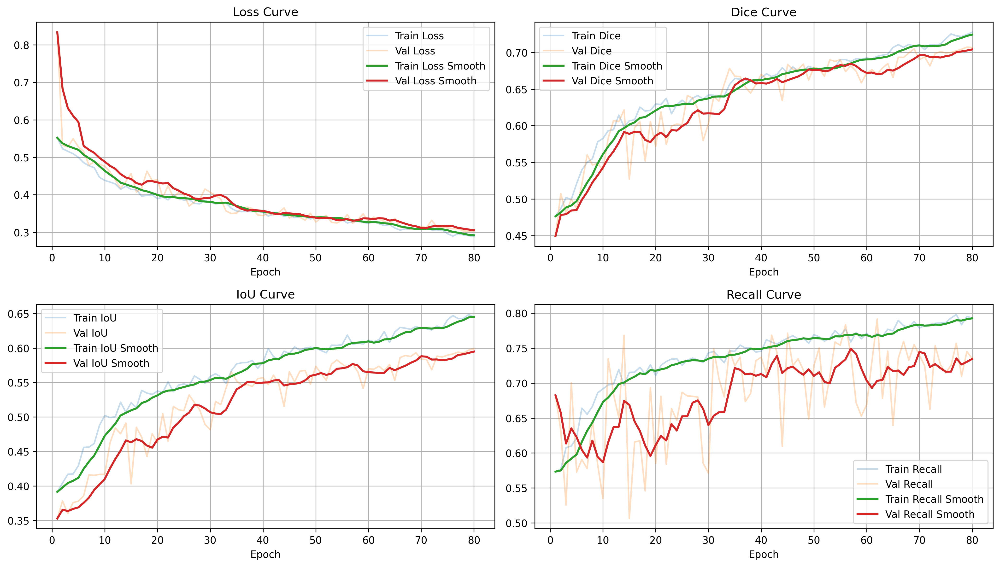
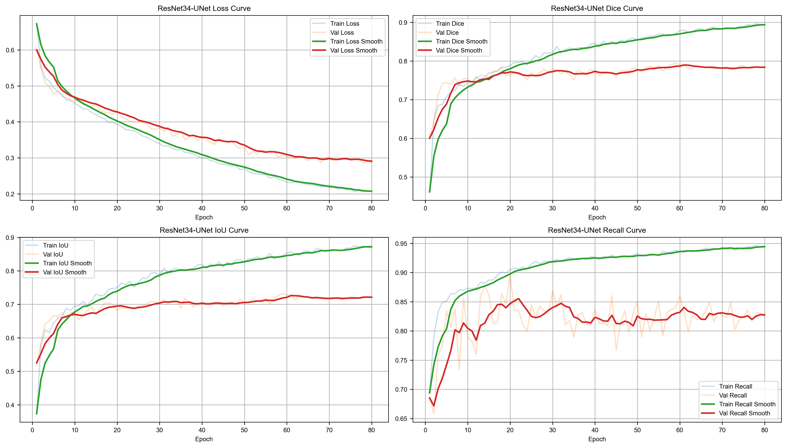
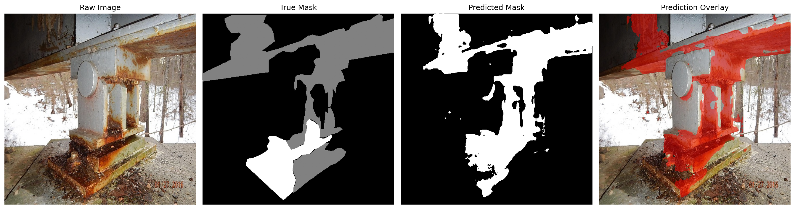
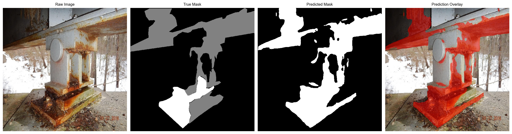

# Corrosion Segmentation

PyTorch project for corrosion semantic segmentation on surface images. This repository compares a baseline U-Net with an ImageNet-pretrained ResNet34-UNet and evaluates segmentation performance using Dice, IoU, Recall, and Precision.

## Overview

This repository contains:

- A custom corrosion segmentation dataset loader
- A baseline U-Net model
- A ResNet34-UNet model with an ImageNet-pretrained encoder
- Dice + BCE training loss
- Training, validation, metric plotting, and prediction visualization utilities
- A Jupyter notebook workflow in `main.ipynb`

## Dataset

This project uses the **Corrosion Condition State Semantic Segmentation Dataset** from the Virginia Tech Data Repository.

Dataset source: [Corrosion Condition State Semantic Segmentation Dataset](https://doi.org/10.7294/16624663)

The dataset contains semantically annotated corrosion images collected from VDOT bridge inspection reports. The official dataset page reports 440 finely annotated images, split into 396 training images and 44 testing images. The original and resized 512x512 images are included in the dataset.

The dataset is **not included in this repository**. Please download it from the official Virginia Tech Data Repository link above and organize it locally as:

```text
data/
`-- 512x512/
    |-- Train/
    |   |-- images_512/
    |   `-- mask_512/
    `-- Test/
        |-- images_512/
        `-- mask_512/
```

## Results

Result figures are stored under `figures/` so GitHub can render them directly in this README.

### Model Comparison



### Validation Metrics

| U-Net | ResNet34-UNet |
| --- | --- |
|  |  |

### Training Curves

| U-Net | ResNet34-UNet |
| --- | --- |
|  |  |

### Prediction Examples

| U-Net | ResNet34-UNet |
| --- | --- |
|  |  |

## Project Structure

```text
.
|-- main.ipynb
|-- requirements.txt
|-- README.md
|-- .gitignore
|-- src/
|   |-- dataset.py
|   |-- models.py
|   |-- predict.py
|   `-- train.py
|-- figures/
|   |-- best_models_comparison.png
|   |-- best_unet_validation_metrics.png
|   |-- best_resnet34_unet_validation_metrics.png
|   |-- unet_training_curves.png
|   |-- resnet34_unet_training_curves.png
|   |-- unet_prediction_example.png
|   `-- resnet34_unet_prediction_example.png
|-- outputs/
|   `-- checkpoints/
`-- data/
    `-- 512x512/
```

## Models

### U-Net

The baseline model is a standard encoder-decoder U-Net with skip connections, convolution blocks, batch normalization, and transposed-convolution upsampling.

### ResNet34-UNet

The second model uses a ResNet34 encoder initialized with ImageNet weights and a U-Net-style decoder. This improves feature extraction while keeping dense pixel-level mask prediction.

## Installation

Create an environment and install the dependencies:

```bash
pip install -r requirements.txt
```

For GPU training, install a PyTorch build that matches your CUDA version from the official PyTorch installation instructions.

## Usage

Open and run:

```text
main.ipynb
```

The notebook covers:

1. Environment setup
2. Dataset loading
3. U-Net training and validation
4. ResNet34-UNet training and validation
5. Prediction visualization
6. Training curve and metric comparison plots

The main training configuration is defined in the notebook, including:

```python
image_size = 512
batch_size = 4
num_epochs = 80
threshold = 0.55
```

## Metrics

The project evaluates segmentation quality using:

- Dice score
- Intersection over Union
- Recall
- Precision

Model checkpoints are saved under `outputs/checkpoints/` during training.

## Citation

Dataset used in this project:

Bianchi, E., & Hebdon, M. **Corrosion Condition State Semantic Segmentation Dataset**. Virginia Tech Data Repository. DOI: [10.7294/16624663](https://doi.org/10.7294/16624663)

If you use this dataset in your own work, please cite the dataset and the related journal article according to the dataset authors' instructions.

## Notes

Large files such as datasets, archives, and model checkpoints are intentionally excluded from Git. The `figures/` folder is used only for lightweight result images that should be displayed in this README.

GitHub language statistics are configured in `.gitattributes` so that `main.ipynb` is not counted as source code. The implementation code lives in `src/`, so the repository language bar should show Python after GitHub refreshes Linguist for the latest commit.
